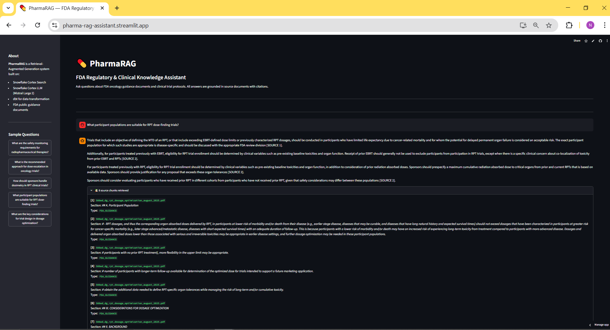
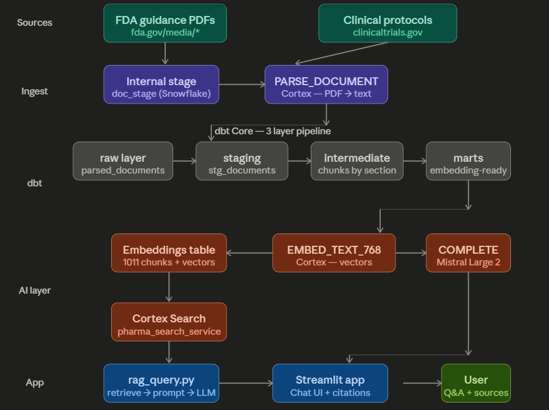

# PharmaRAG — FDA Regulatory Knowledge Assistant
🔗 **Live Demo**: https://pharma-rag-assistant.streamlit.app



A production-grade Retrieval-Augmented Generation (RAG) system built on 
Snowflake Cortex for querying FDA oncology guidance documents and clinical 
trial protocols. Built as part of a pharma AI portfolio demonstrating 
enterprise-grade GenAI architecture.

---

## Problem Statement

Regulatory affairs and medical affairs teams in pharma spend significant time 
manually searching through hundreds of FDA guidance documents and clinical 
trial protocols to answer specific questions. PharmaRAG reduces this to 
seconds by enabling natural language querying over a curated corpus of 
regulatory documents, with every answer grounded in cited source documents.

---

## Architecture



### Pipeline Overview

| Layer | Technology | Purpose |
|-------|-----------|---------|
| Ingestion | Snowflake Internal Stage + PARSE_DOCUMENT | PDF → structured text |
| Transform | dbt Core (staging → intermediate → marts) | Clean, chunk, validate |
| Embedding | Snowflake Cortex EMBED_TEXT_768 | Text → vectors |
| Retrieval | Snowflake Cortex Search | Semantic + keyword search |
| Generation | Snowflake Cortex COMPLETE (Mistral Large 2) | Grounded answer + citations |
| Application | Streamlit | Chat UI with source attribution |

---

## Tech Stack

- **Snowflake Cortex** — PARSE_DOCUMENT, EMBED_TEXT_768, Cortex Search, COMPLETE
- **dbt Core 1.11** — 3-layer transformation pipeline with tests and lineage
- **Python 3.11** — RAG orchestration layer
- **Streamlit 1.58** — Chat interface
- **FDA public data** — 40 oncology guidance documents, 1,011 chunks

---

## Project Structure
pharma-rag-assistant/
├── app.py                    # Streamlit chat application
├── src/
│   └── rag_query.py          # RAG pipeline (retrieve → prompt → generate)
├── pharma_rag_dbt/           # dbt project
│   ├── models/
│   │   ├── staging/          # stg_documents (clean + classify)
│   │   ├── intermediate/     # int_document_chunks (section-based chunking)
│   │   └── marts/            # docs_ready_for_embedding + tests
│   └── macros/               # Custom schema name macro
├── docs/
│   └── architecture.html     # Architecture diagram
├── requirements.txt
└── README.md
---

## Key Design Decisions

**Snowflake-native parsing over Python libraries**
Used `PARSE_DOCUMENT` (Cortex) instead of PyMuPDF or unstructured.io — 
keeps all processing in-warehouse, reduces pipeline complexity, and preserves 
document layout/section structure via markdown headers.

**Section-based chunking over fixed word count**
Split documents on markdown `#`/`##` headers rather than arbitrary token 
limits. Each chunk maps to one logical section, producing semantically 
coherent retrieval units.

**dbt for all transformations**
Python handles only PDF upload and app layer. Every transformation once data 
lands in Snowflake is handled by dbt — providing lineage, testing, and 
auditability that matches pharma data governance expectations.

**Mandatory citation in every answer**
Prompt engineering enforces `[SOURCE X]` citations for every claim. If 
the answer is not in retrieved chunks, the model says so rather than 
hallucinating — critical for regulatory use cases.

---

## Snowflake Setup

### Prerequisites
- Snowflake trial or enterprise account
- Cortex features enabled (PARSE_DOCUMENT, EMBED_TEXT, Cortex Search)

### Run the pipeline

```sql
-- 1. Create infrastructure
CREATE WAREHOUSE pharma_rag_wh WAREHOUSE_SIZE='XSMALL' AUTO_SUSPEND=60;
CREATE DATABASE pharma_rag_db;
CREATE SCHEMA pharma_rag_db.raw;
CREATE SCHEMA pharma_rag_db.staging;
CREATE SCHEMA pharma_rag_db.intermediate;
CREATE SCHEMA pharma_rag_db.marts;
CREATE STAGE pharma_rag_db.raw.doc_stage DIRECTORY=(ENABLE=TRUE);

-- 2. Upload PDFs to stage via Snowsight UI

-- 3. Parse documents
INSERT INTO pharma_rag_db.raw.parsed_documents (relative_path, parsed_content)
SELECT RELATIVE_PATH,
    SNOWFLAKE.CORTEX.PARSE_DOCUMENT(
        '@pharma_rag_db.raw.doc_stage', RELATIVE_PATH, {'mode': 'LAYOUT'}
    )
FROM DIRECTORY(@pharma_rag_db.raw.doc_stage);
```

---

## Local Setup

```bash
# Clone repo
git clone https://github.com/YOUR_USERNAME/pharma-rag-assistant.git
cd pharma-rag-assistant

# Create virtual environment (Python 3.11 required)
py -3.11 -m venv venv
venv\Scripts\activate

# Install dependencies
pip install -r requirements.txt

# Configure environment
cp .env.example .env
# Edit .env with your Snowflake credentials

# Run dbt pipeline
cd pharma_rag_dbt
dbt run
dbt test

# Launch app
cd ..
streamlit run app.py
```

---
---

## Evaluation Results

Evaluated against a 10-question ground truth test set covering safety 
monitoring, dosimetry, trial design, participant populations, and endpoints.

| Metric | Score |
|--------|-------|
| Keyword accuracy | 89% |
| Source retrieval accuracy | 85% |
| Overall score | 87% |
| Refusal rate | 0% |

Full results: `docs/eval_results.json`

---

## Sample Questions

- "What are the safety monitoring requirements for radiopharmaceutical therapies?"
- "What is the recommended approach for dose escalation in oncology trials?"
- "How should informed consent address radiation toxicity risks?"
- "What is the difference between EBRT and RPT dosing approaches?"
- "What are the key endpoints for cancer drug approval?"

---

## Data Sources

All documents are publicly available FDA guidance documents:
- FDA Oncology Center of Excellence guidance documents
- Clinical trial protocols from ClinicalTrials.gov
- No patient data, no PHI — all public regulatory documents

---

## Author

Built by a pharma AI practitioner with 12 years of life sciences experience 
and expertise in Snowflake Cortex, agentic AI, and cross-functional team 
leadership. Part of a 3-project GenAI portfolio targeting senior AI roles 
in pharma and life sciences.

---

## License

MIT License
